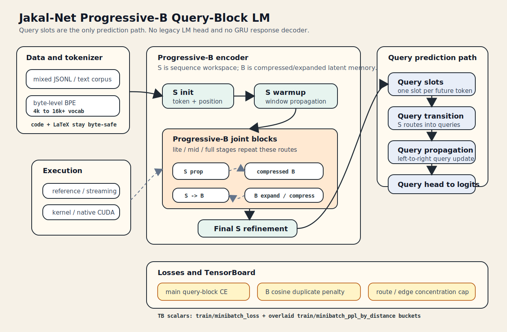

# Jakal-Net

Jakal-Net is a PyTorch research playground for latent-node propagation,
sparse routing, and the Progressive-B language-model experiments built on top
of those operators.

The codebase is split into two layers:

- `src/jakal_net/`: reusable operator primitives such as `Layer`,
  propagation, transition, sparse routing, and native backend dispatch.
- `scripts/`: experiment code for Progressive-B, corpus builders, training
  loops, checkpointing, TensorBoard logging, and native extension build
  helpers.

## Architecture



Progressive-B is not a standard decoder-only LM stack. It encodes a fixed
prefix into a sequence workspace `S`, repeatedly exchanges information with a
compressed and expanded latent memory workspace `B`, then predicts future
tokens through a separate query path.

At a high level, the current query-block path is:

```text
prefix ids
  -> token/position embedding
  -> S warmup
  -> Progressive-B joint blocks over S and B
  -> final S refinement
  -> query slots
  -> query transition
  -> query propagation
  -> query head
  -> token logits
```

There is no legacy LM head and no GRU response decoder in the current model.
The vocabulary projection belongs to the query head, so trainable parameters
track the query-based objective directly.

## Core Architecture

### 1. Sequence workspace `S`

`S` is the token-aligned workspace. Each token position owns:

- a scalar state in `Layer.state`
- a vector value in `Layer.val`

`S` starts from token embeddings plus learned positional encodings, then runs
window or dense same-layer propagation. This is the part of the model that
most closely resembles a conventional sequence encoder, except that it is
expressed with the general `Layer` / `Propagation` operator API instead of a
Transformer block API.

### 2. Bottleneck workspace `B`

`B` is the latent memory system. Each Progressive-B joint block creates or
updates two `B` views:

- expanded `B`: wider latent workspace used for richer internal propagation
- compressed `B`: smaller bottleneck workspace used to carry summarized state
  across blocks

Inside each joint block, information moves through:

1. same-layer propagation on `S`
2. `S -> expanded B` routing
3. same-layer propagation inside expanded `B`
4. `expanded B -> S` routing
5. `expanded B -> compressed B` compression
6. optional `S -> compressed B` update
7. same-layer propagation inside compressed `B`

That is the central architectural idea of this repository: sequence processing
is mediated by a reusable latent memory workspace instead of relying only on a
single token-aligned stream.

### 3. Query prediction path

Prediction does not read directly from the last token state. Instead, the model
creates a dedicated query workspace:

- one query slot per future token position
- `query_transition` routes information from encoded `S` into those slots
- `query_propagation` updates the slots causally from left to right
- `query_head` maps final query slot values to vocabulary logits

This makes the forecasting path explicit. The encoded prefix lives in `S`,
while the prediction process lives in a separate query layer with its own
causal propagation.

### 4. Execution backends

The same architecture can run through several implementations:

- `reference`
- `streaming`
- `kernel`
- `native`

The backend choice changes execution strategy, not the high-level model graph.

## Compared With Existing LM Architectures

The most useful comparison point is a standard decoder-only Transformer LM.

| Aspect | Standard decoder-only LM | Jakal-Net Progressive-B |
| --- | --- | --- |
| Main working space | Single token-aligned hidden sequence | Token-aligned `S` plus latent `B` workspaces |
| Cross-token interaction | Self-attention over the same sequence | `Propagation` on `S`, plus routed interaction through expanded and compressed `B` |
| Long-range summarization | Implicit inside attention layers and residual stream | Explicit latent memory bottleneck carried across joint blocks |
| Prediction path | Read logits from the final token stream | Build dedicated query slots, route `S` into them, then propagate queries causally |
| Architectural unit | Attention + MLP block | General propagation + transition operators composed into joint `S/B` blocks |
| Sparsity control | Usually attention mask or custom sparse attention kernels | Window, top-k, query-top-k, dense, and routed sparse transitions |
| Execution abstraction | Usually tied closely to one attention implementation | Same operator graph can dispatch to reference, streaming, kernel, or native backends |

Another way to say it:

- A standard decoder-only LM keeps one residual stream and predicts from that
  stream directly.
- Progressive-B separates encoding, latent memory exchange, and prediction into
  different workspaces.
- The architectural bet is that explicit routed latent memory may scale
  differently from a pure token-only stack and can support more flexible sparse
  execution paths.

This repository is therefore closer to an operator research platform for
alternative LM structure than to a conventional Transformer implementation.

## Current Capabilities

- Same-layer node message passing with `Propagation` and `SparsePropagation`.
- Cross-layer information movement with `Transition` and `SparseTransition`.
- Dense, window, top-k, and query-top-k execution paths.
- Reference, streaming, kernel, and native backend implementations.
- Native C++/CUDA extension support for selected propagation and transition
  kernels.
- Progressive-B example LM with warmup `S` propagation, lite/mid/full `B`
  stages, final `S` refinement, query transition, query propagation, and
  query-only vocab prediction.
- Training objectives: `query_next_token` and `query_block`.
- Byte-level BPE tokenization, including larger vocabularies for code and
  LaTeX-heavy corpora.
- TensorBoard logging focused on total minibatch loss and overlaid
  distance-bucket perplexity curves.
- Best/last/final checkpoint artifacts for experiment tracking.

## Repository Layout

| Path | Purpose |
| --- | --- |
| `src/jakal_net/core.py` | `Layer`, `LayerDelta`, block helpers, validation |
| `src/jakal_net/propagation.py` | Dense and sparse same-layer propagation |
| `src/jakal_net/transition.py` | Dense and sparse cross-layer routing |
| `src/jakal_net/modules.py` | Pairwise scorers, route modules, position encoding |
| `src/jakal_net/native_backend.py` | Native extension discovery and dispatch |
| `native/` | C++/CUDA extension source |
| `scripts/progressive_b_example.py` | Progressive-B model and training utilities |
| `scripts/train_progressive_b_lm.py` | CLI training entry point |
| `scripts/build_mixed_next_sentence_corpus.py` | Mixed dialogue/science/wiki/code pair corpus builder |
| `tests/` | Unit tests and native backend checks |
| `docs/architecture.svg` | Architecture diagram used by this README |

## Installation

Create a virtual environment and install dependencies.

### Linux or macOS

```bash
python3 -m venv .venv
source .venv/bin/activate
python -m pip install -r requirements.txt
export PYTHONPATH=src
```

### Windows PowerShell

```powershell
py -m venv .venv
.\.venv\Scripts\Activate.ps1
python -m pip install -r requirements.txt
$env:PYTHONPATH = "src"
```

For CUDA, install the matching PyTorch CUDA wheel for the target system before
running GPU experiments. The native extension build requires a working compiler
toolchain and CUDA toolkit when CUDA kernels are enabled.

## Quick Checks

Run the smoke test:

```bash
PYTHONPATH=src python scripts/smoke_test.py --device cpu
```

Run unit tests:

```bash
PYTHONPATH=src python -m unittest discover -s tests
```

Build the native extension:

```bash
PYTHONPATH=src python scripts/build_native_extension.py
```

Inspect native backend support:

```bash
PYTHONPATH=src python - <<'PY'
from jakal_net.native_backend import native_status
print(native_status())
PY
```

## Training Examples

Small query-block smoke run:

```bash
PYTHONPATH=src python scripts/train_progressive_b_lm.py \
  --device cuda \
  --training-objective query_block \
  --tokenizer byte_bpe \
  --subword-vocab-size 4096 \
  --seq-len 128 \
  --target-len 32 \
  --steps 100 \
  --batch-size 16 \
  --dim 128 \
  --tensorboard \
  --run-name smoke_next_token
```

Mixed corpus query-block run with a larger byte BPE vocabulary:

```bash
PYTHONPATH=src python scripts/train_progressive_b_lm.py \
  --device cuda \
  --training-objective query_block \
  --jsonl-source artifacts/data/mixed_next_sentence_dialogue_science_wiki_code.jsonl \
  --tokenizer byte_bpe \
  --tokenizer-prefix artifacts/tokenizers/mixed_next_sentence_byte_bpe_16384 \
  --subword-vocab-size 16384 \
  --seq-len 512 \
  --target-len 128 \
  --steps 100000 \
  --eval-interval 1000 \
  --eval-steps 16 \
  --checkpoint-interval 1000 \
  --batch-size 64 \
  --dim 384 \
  --warmup-layers 2 \
  --lite-layers 5 \
  --mid-layers 5 \
  --full-layers 0 \
  --final-refine-layers 3 \
  --route-topk 32 \
  --route-mode topk \
  --route-kind low_rank_bilinear \
  --route-hidden-dim 64 \
  --pairwise-kind low_rank_bilinear \
  --pairwise-hidden-dim 64 \
  --norm-position pre \
  --edge-dropout-p 0.1 \
  --balance-batch-by-source \
  --data-workers 8 \
  --prefetch-factor 4 \
  --pretokenize-workers 32 \
  --b-diversity-loss-weight 0.02 \
  --b-cosine-margin 0.20 \
  --route-concentration-loss-weight 0.05 \
  --route-load-cap 0.20 \
  --edge-prob-cap 0.55 \
  --precision bf16 \
  --implementation native \
  --tensorboard \
  --save-checkpoint
```

The training script writes:

- TensorBoard events under each run directory
- run summaries, metrics, samples, and checkpoints under
  `artifacts/training_runs/`
- best and last checkpoints under `custom/checkpoints/` when
  `--save-checkpoint` is enabled

Launch TensorBoard against the current artifact root:

```bash
tensorboard --logdir artifacts/training_runs
```

## Losses and Prediction Head

`query_block` predicts a block of future tokens from a prefix. It builds query
slots from the encoded `S` workspace, lets those slots receive routed
information from `S`, then updates query slots left-to-right through query
propagation. The query head maps the final query slot values to vocabulary
logits.

The main objective is cross entropy over the query block. For monitoring, the
same logits are also split into four distance buckets so TensorBoard can show
short-, mid-, and long-distance perplexity on one plot.

Two auxiliary losses can be enabled:

- `--b-diversity-loss-weight` penalizes compressed `B` nodes whose cosine
  similarity exceeds `--b-cosine-margin`.
- `--route-concentration-loss-weight` penalizes route or edge concentration
  only when destination load or single-edge probability exceeds configured
  caps. It is not a uniform-routing loss; it specifically discourages collapse
  onto one node.

## Operator Model

`Layer` is the base storage object:

| Field | Shape | Meaning |
| --- | --- | --- |
| `state` | `[..., num_nodes]` | Scalar node activation/state |
| `val` | `[..., num_nodes, dim]` | Vector node value |

`LayerDelta` stores matching updates:

| Field | Shape |
| --- | --- |
| `delta_state` | `[..., num_nodes]` |
| `delta_val` | `[..., num_nodes, dim]` |

`Propagation` performs same-layer message passing. It scores node pairs,
compresses edge scores, transports state/value projections, and returns a
`LayerDelta` or updated `Layer`.

`SparsePropagation` restricts same-layer message passing to a causal window or
top-k source set.

`Transition` moves information from a source layer to a destination layer by
building route logits and reducing transported source values into destination
nodes.

`SparseTransition` keeps only top-k destination routes per source before
transport. It supports edge dropout and usage-aware dropout in the
experimental paths used by Progressive-B.

## Progressive-B Example LM

The example LM in `scripts/progressive_b_example.py` is intentionally kept
outside the package surface. It composes the public operators into a staged
encoder:

1. Token embedding plus learned position encoding initializes the `S` layer.
2. `S` warmup applies window sparse propagation.
3. Each Progressive-B joint block updates `S`, expands compressed `B` memory,
   propagates through expanded `B`, sends information back to `S`, recompresses
   `B`, and optionally lets `S` update compressed `B`.
4. Final `S` refinement prepares the encoded prefix state.
5. Query slots are initialized for future-token positions.
6. Query transition routes `S` information into those slots.
7. Query propagation updates the slots left-to-right.
8. The query head projects query slot values to vocabulary logits.

The current large query-block configurations use bilinear, Hadamard-MLP, or
additive-style pairwise/route modules depending on the experiment, along with
byte BPE vocabularies sized for mixed dialogue, science, wiki, code, and
LaTeX-heavy text.

## Corpus Paths

The training CLI can read:

- plain text files with `--text-file`
- repeated text files, directories, or globs with `--text-source`
- JSONL text records with `--jsonl-source --jsonl-text-key`
- Hugging Face datasets with `--hf-dataset`
- explicit dialogue or prefix/response records with `prefix` and `response`
  fields

`next_sentence_response` first converts source text or explicit JSONL records
into prefix/response pairs, then trains the response decoder with masked
cross-entropy over the response tokens.

## Development Notes

- Keep generated artifacts out of commits unless the artifact is intentionally
  part of a regression fixture.
- Prefer `artifacts/tensorboard/<run-name>` for TensorBoard runs and archive
  old runs outside the active logdir when the UI gets noisy.
- Run smoke tests and unit tests before pushing operator changes.
- If native backend behavior changes, update both `native/` and
  `tests/test_native_backend.py`.

## License

This repository is distributed under Apache 2.0. See [LICENSE](./LICENSE) for
the full text.
